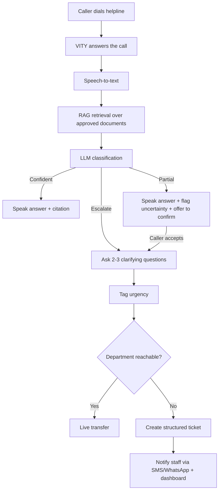
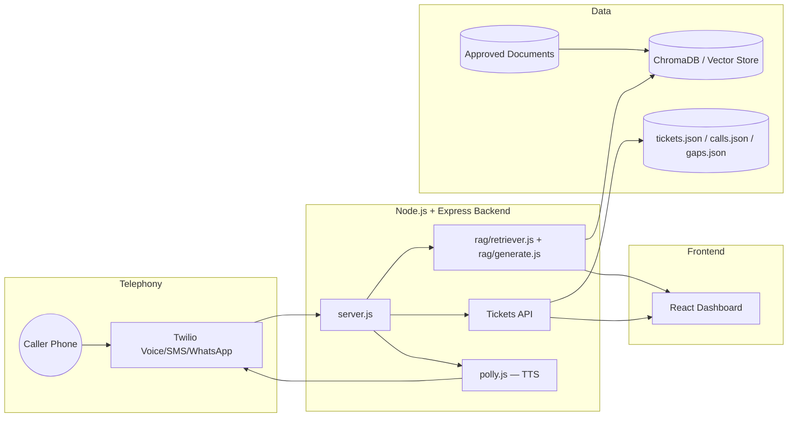
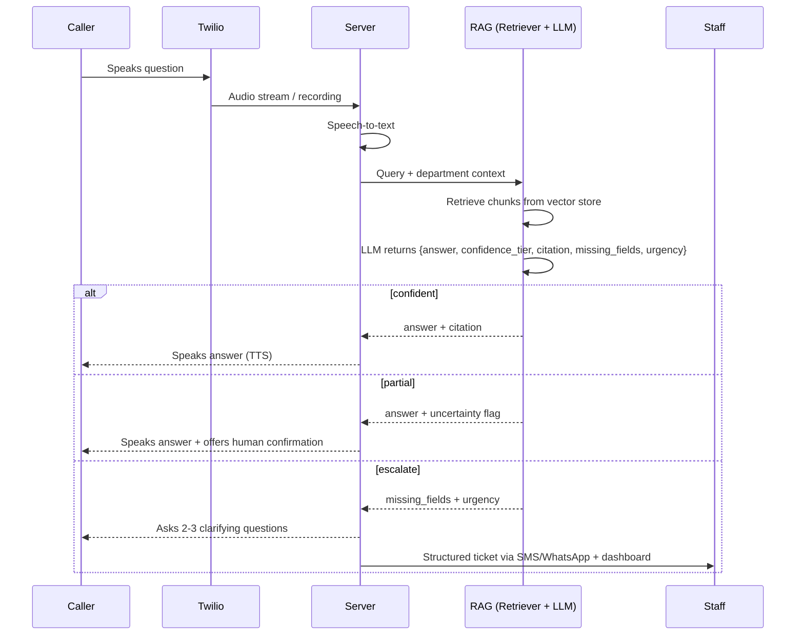

# VITY

> The phone-first AI agent that is the college helpline — grounded answers, disciplined escalation, and handoffs staff can act on in seconds.

VITY is an AI voice agent that answers a college's helpline directly. Students and parents call in, ask their question out loud, and VITY converts speech to text, retrieves grounded answers from the college's own approved documents (fee schedules, exam rules, hostel policies, procedures), and speaks back a cited answer. When it isn't confident, it asks 2-3 targeted follow-up questions to gather missing details, then either connects the caller to the right department or files a structured, pre-filled ticket — so staff spend less time answering the same routine questions over and over.

Built on top of **Saathi**, an existing Node/Express + Twilio voice-agent codebase, repurposed from a rural-outreach missed-call bot into a campus-side inbound helpdesk triage agent.

---

## Table of Contents

- [Why VITY](#why-vity)
- [How It Works](#how-it-works)
- [Architecture](#architecture)
- [AI Pipeline](#ai-pipeline)
- [Prerequisites](#prerequisites)
- [Installation](#installation)
- [Configuration](#configuration)
- [Usage](#usage)
- [Project Structure](#project-structure)
- [Roadmap](#roadmap)
- [Contributing](#contributing)
- [License](#license)
- [Contact](#contact)

---

## Why VITY

Campus staff repeatedly answer the same questions about forms, approvals, schedules, and procedures. Most of that traffic still arrives by phone, since phone remains the primary channel for parents and less app-literate students. A web chatbot doesn't fix this — it adds a channel while phone volume stays the same.

VITY intercepts the actual channel generating the workload. It answers what it can verify, is honest about what it can't, and hands off only what genuinely needs a human — with enough structure that staff can act on it immediately instead of parsing a raw complaint.

## How It Works

1. A caller dials the helpline number. VITY answers directly.
2. Speech-to-text converts the spoken question into text.
3. A RAG pipeline retrieves relevant chunks from the college's approved documents, namespaced by department.
4. A single LLM call classifies the response into one of three tiers:
   - **Confident** — answered directly, with a cited source.
   - **Partial** — answered, but VITY flags its own uncertainty and offers to connect the caller to a human for confirmation.
   - **Escalate** — VITY asks 2-3 targeted clarifying questions, tags urgency, and either transfers the call live to a reachable department (an optional flourish) or creates a structured ticket for staff follow-up (the reliable default).
5. Every escalation is logged, so recurring topics and documentation gaps surface on a staff-facing insights view over time.



## Architecture



## AI Pipeline



## Prerequisites

Before you begin, make sure you have:

- **Node.js** `>= 18`
- A **Twilio** account (a free trial account works for development)
- An **LLM API key** — Gemini or Groq (both have usable free tiers)
- (Optional) **AWS account** for Amazon Polly, if you want text-to-speech beyond Twilio's built-in `<Say>`
- (Optional) **Meta developer account** for the WhatsApp channel
- (Optional) **Bhashini API credentials** for Hindi voice-note transcription
- **ngrok** or a deployed public HTTPS URL, so Twilio can reach your local server during development

## Installation

Clone the repository and install backend dependencies:

```bash
git clone https://github.com/your-org/vity.git
cd vity/backend
npm install
```

Copy the environment template and fill in your own credentials:

```bash
cp .env.example .env
```

## Configuration

Set the following variables in your `.env` file:

```bash
# Twilio
TWILIO_ACCOUNT_SID=ACxxxxxxxxxxxxxxxxxxxxxxxxxxxxxxxx
TWILIO_AUTH_TOKEN=your_auth_token_here
TWILIO_NUMBER=+15005550006

# Public HTTPS URL Twilio can reach (ngrok URL during dev, or your deployed URL)
PUBLIC_URL=https://your-public-url.ngrok-free.app

PORT=3000

# LLM provider (choose one)
GEMINI_API_KEY=your_gemini_api_key
GROQ_API_KEY=your_groq_api_key

# --- Optional: WhatsApp channel ---
WHATSAPP_TOKEN=your_temporary_or_permanent_access_token
WHATSAPP_PHONE_NUMBER_ID=your_phone_number_id
WHATSAPP_VERIFY_TOKEN=choose_any_secret_string

# --- Optional: Amazon Polly (TTS) ---
AWS_ACCESS_KEY_ID=your_aws_access_key
AWS_SECRET_ACCESS_KEY=your_aws_secret_key
AWS_REGION=ap-south-1
POLLY_VOICE=Kajal

# --- Optional: Bhashini (Hindi voice-note transcription) ---
BHASHINI_USER_ID=your_ulca_user_id
BHASHINI_API_KEY=your_ulca_api_key
```

Department contacts, document folders, and college-specific settings live in `backend/config/departments.json` — edit this to add or remove departments without touching any code.

## Usage

**Just want to see the dashboard UI?**

```bash
open frontend/index.html
```

No build step required.

**Want the real voice pipeline running end-to-end?**

```bash
cd backend
npm run demo
```

This starts the server and prints a public URL (via ngrok). Point your Twilio phone number's webhook at that URL, then call the number to talk to VITY.

**Ingest your college's documents into the vector store:**

```bash
node rag/ingest.js --dir ./data/documents
```

**Run the backend only, without the auto-tunnel:**

```bash
npm start
```

## Project Structure

```
vity/
├── frontend/
│   ├── index.html              # standalone dashboard demo, no build step
│   └── saathi-prototype.jsx    # React version of the dashboard
└── backend/
    ├── server.js                # Express server, Twilio webhooks, call flow
    ├── rag/
    │   ├── ingest.js            # chunks + embeds documents into the vector store
    │   ├── retriever.js         # retrieval logic, per-department namespace
    │   └── generate.js          # structured LLM output (answer/confidence/citation)
    ├── config/
    │   └── departments.json      # department contacts, portable per college
    ├── data/
    │   ├── tickets.json
    │   ├── calls.json
    │   ├── gaps.json
    │   └── documents/            # approved source PDFs, per department
    ├── whatsapp.js               # WhatsApp channel integration
    ├── polly.js                  # Amazon Polly text-to-speech
    ├── bhashini.js                # Hindi speech-to-text
    ├── audio.js                   # audio format conversion helper
    ├── autosetup.js               # `npm run demo` — one-command local setup
    └── .env.example
```

## Roadmap

- [x] Inbound call handling with speech-to-text
- [x] RAG retrieval over approved department documents
- [x] Three-tier confidence classification (confident / partial / escalate)
- [x] Structured, pre-filled ticket creation with urgency tagging
- [x] Caller-history recognition for repeat callers
- [x] Knowledge-gap logging and aggregate insights view
- [ ] Closed-loop SLA auto-escalation for un-actioned tickets
- [ ] Cross-document contradiction detection
- [ ] Proactive outbound reminder calls for known deadlines
- [ ] Self-serve multi-college onboarding
- [ ] Real authentication and role-based dashboard access
- [ ] Integration with existing college ERP/ticketing systems

## Contributing

Issues and pull requests are welcome. If you're proposing a larger change (new department logic, a different LLM provider, a schema change to tickets), open an issue first so the approach can be discussed before implementation.

## License

MIT — see [`LICENSE`](./LICENSE).

## Contact

Built for [Hackathon Name] at VIT Bhopal.

- Team: *[team name placeholder]*
- Maintainers: *[names/contacts placeholder]*
