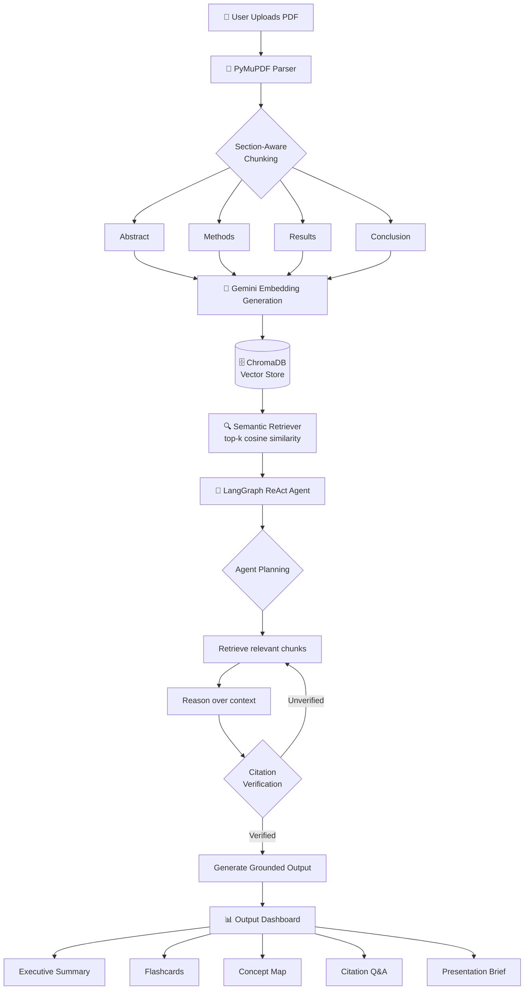
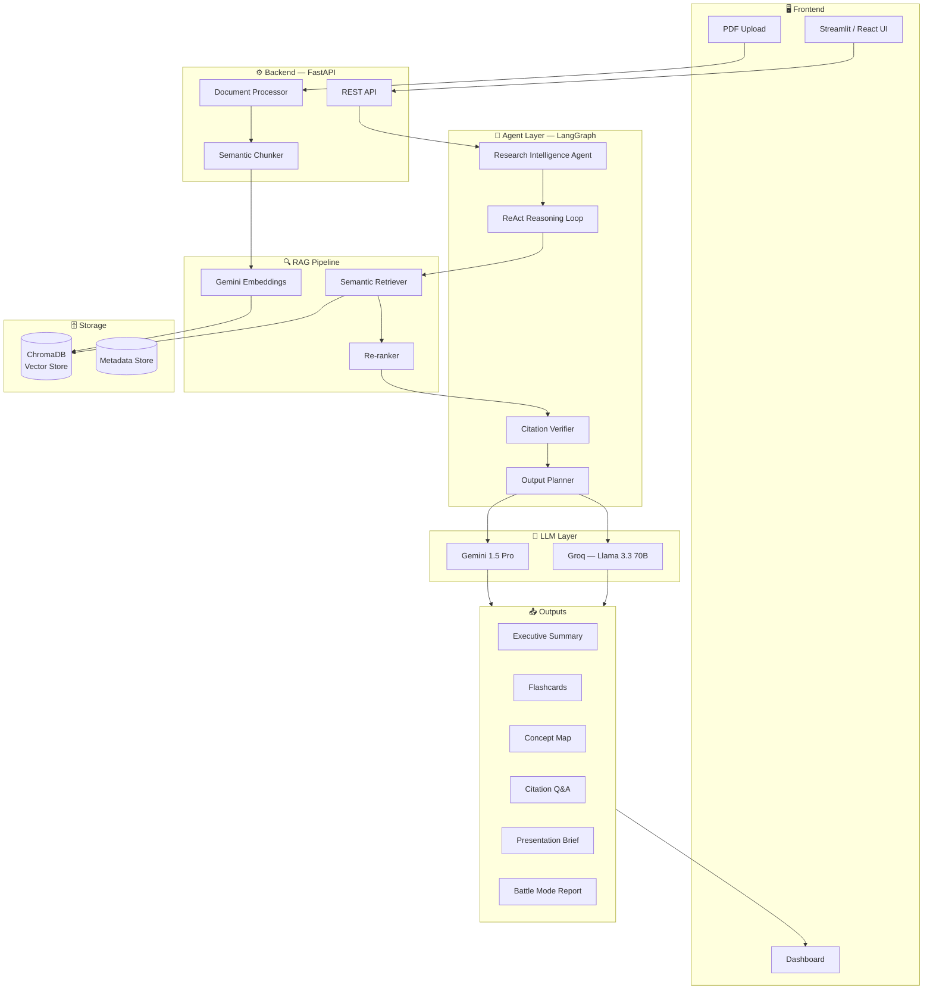

<div align="center">

<!-- Logo -->


# PaperPilot AI

### *We don't summarize papers. We transform them into understanding.*

An AI Research Analyst that converts complex academic papers into structured knowledge assets — executive summaries, flashcards, concept maps, citation-backed Q&A, and more — in minutes, not hours.

<br/>

[](https://opensource.org/licenses/MIT)
[](https://github.com/giri-harsh/paperpilot-ai)
[](https://www.python.org/)
[](https://fastapi.tiangolo.com/)
[](https://github.com/langchain-ai/langgraph)
[](https://github.com/giri-harsh/paperpilot-ai)
[](https://deepmind.google/technologies/gemini/)
[](https://github.com/giri-harsh/paperpilot-ai)
[](https://github.com/giri-harsh/paperpilot-ai/commits)
[](https://github.com/giri-harsh/paperpilot-ai/stargazers)
[](https://github.com/giri-harsh/paperpilot-ai/issues)

<br/>

[**Live Demo**](#demo) · [**Documentation**](#how-it-works) · [**Quick Start**](#installation) · [**Report Bug**](https://github.com/giri-harsh/paperpilot-ai/issues)

<br/>

<!-- Hero Banner -->


</div>

---

## Table of Contents

- [The Problem](#-the-problem)
- [Our Solution](#-our-solution)
- [Demo](#-demo)
- [Features](#-features)
- [How It Works](#-how-it-works)
- [System Architecture](#-system-architecture)
- [Tech Stack](#-tech-stack)
- [Project Structure](#-project-structure)
- [Installation](#-installation)
- [Environment Variables](#-environment-variables)
- [API Overview](#-api-overview)
- [Example Workflow](#-example-workflow)
- [Roadmap](#-roadmap)
- [Challenges Solved](#-challenges-solved)
- [Future Improvements](#-future-improvements)
- [Contributing](#-contributing)
- [Team](#-team)
- [Acknowledgements](#-acknowledgements)
- [License](#-license)

---

## 🔴 The Problem

Researchers, students, and hackathon teams face the same wall every time they encounter a new academic paper:

> **52% of reading time is lost just parsing methodology sections** — before anyone even reaches the findings.

The current research workflow is fundamentally broken:

| Stage | The Reality |
|---|---|
| **Reading** | Dense academic language requires multiple passes |
| **Comprehension** | No structured path from paper → understanding |
| **Comparison** | Evaluating multiple papers is fully manual |
| **Retention** | No tools convert papers into study-ready assets |
| **Application** | Insight extraction is slow, error-prone, inconsistent |

**Existing tools stop at summarization.** Elicit, SciSpace, and even GPT-4 give you a shorter version of the same confusion. They don't teach. They don't compare. They don't cite. They don't generate flashcards or concept maps. They hand you a summary and leave you to figure out the rest.

For a PhD student with 30 papers in a literature review, this isn't a minor inconvenience — it's weeks of lost time.

---

## ✅ Our Solution

**PaperPilot AI** is an intelligent research analyst agent that goes far beyond summarization.

Upload any academic PDF. PaperPilot's RAG-powered agent reads it at a structural level — parsing sections, extracting claims, mapping methodology, identifying limitations — then generates a complete suite of learning and productivity assets, every output grounded in citations.

### What makes us different

| Capability | Elicit | SciSpace | ChatGPT | **PaperPilot AI** |
|---|:---:|:---:|:---:|:---:|
| Summary | ✓ | ✓ | ✓ | ✓ |
| Key Claims Extraction | — | — | — | ✓ |
| Methodology Breakdown | — | Partial | — | ✓ |
| Flashcard Generation | — | — | — | ✓ |
| Concept Map | — | — | — | ✓ |
| Multi-Paper Comparison | — | — | — | ✓ |
| Citation-Backed Q&A | — | Partial | — | ✓ |

**Research Battle Mode™** — upload two papers and get an automated, citation-grounded structured comparison across methodology, dataset, results, strengths, and weaknesses. No other tool does this.

---

## 🎬 Demo

<div align="center">
</div>

<details>
<summary>📸 Screenshots</summary>

<br/>

**Dashboard Overview**


**Executive Summary Output**


**Research Battle Mode**


**Concept Map Visualization**


</details>

<br/>

> 🔗 **Live Demo:** [paperpilot.harshgiri.site](https://paperpilot.harshgiri.site) <br>
> 📹 **Demo Video:** [Watch on YouTube](#)<br>
> 📊 **Presentation:** [View Slide Deck](#)<br>
> 🏆 **Hackathon Page:** [VIT Bhopal Hackathon 2026](#)

---

## ✨ Features

### 🧠 Core AI Features

- **Research Intelligence Agent** — LangGraph ReAct agent with structured reasoning: Retrieve → Reason → Generate → Cite
- **Section-Aware Semantic Chunking** — chunks by document structure (Abstract, Methods, Results, Conclusion), not arbitrary token count
- **Hallucination Reduction** — every output grounded to retrieved source chunks; citations shown inline with page/section reference
- **Agent Self-Verification** — agent validates outputs before returning results

### 📚 Knowledge Extraction

- [x] **Executive Summary** — core contribution in plain language
- [x] **Key Claims Extraction** — isolated findings with source grounding
- [x] **Methodology Breakdown** — how results were actually produced
- [x] **Limitation Detection** — what the authors acknowledge falls short
- [x] **Future Research Suggestions** — open problems worth pursuing

### 🎓 Learning Assets

- [x] **Flashcard Generation** — dense sections converted to spaced-repetition cards
- [x] **Concept Map** — visual graph of how ideas in the paper connect
- [x] **Presentation Brief** — slide-ready talking points without manual formatting

### ⚔️ Research Features

- [x] **Research Battle Mode™** — upload two papers, get an automated structured comparison
- [x] **Citation-Backed Q&A** — ask any question, receive answers traced to source sections
- [x] **Multi-Paper Comparison** — evaluate methodology, datasets, results side by side

### ⚡ Productivity Features

- [x] One-click output generation
- [x] All outputs exportable
- [x] Clean dashboard interface
- [x] Fast processing pipeline (< 30 seconds per paper)

### 🗺️ Roadmap Features

- [ ] Multi-paper library management
- [ ] Collaborative annotation workspace
- [ ] Export to Notion, Obsidian, Anki
- [ ] Institution API licensing
- [ ] Browser extension (read any paper inline)
- [ ] Semantic Scholar integration

---

## ⚙️ How It Works



### Step-by-Step

| Step | Component | Description |
|---|---|---|
| **1. Ingest** | PyMuPDF | PDF parsed into structured sections, not raw text |
| **2. Chunk** | Custom Chunker | Semantic chunking preserves section boundaries |
| **3. Embed** | Gemini Embeddings | Each chunk embedded into high-dimensional vector space |
| **4. Index** | ChromaDB | Vectors stored with metadata (section, page, position) |
| **5. Retrieve** | Retriever | Cosine similarity search, configurable top-k |
| **6. Reason** | LangGraph Agent | ReAct loop: retrieve → reason → generate → verify → cite |
| **7. Output** | Output Generator | Structured assets rendered to dashboard |

---

## 🏗️ System Architecture



---

## 🛠️ Tech Stack

### Core

| Layer | Technology | Purpose |
|---|---|---|
| 🐍 **Language** | Python 3.11+ | Primary runtime |
| ⚡ **Backend** | FastAPI | REST API, async request handling |
| 🖥️ **Frontend** | Streamlit / React | User interface & dashboard |

### AI & ML

| Component | Technology | Purpose |
|---|---|---|
| 🤖 **Agent Framework** | LangGraph | ReAct agent with stateful reasoning loop |
| 🔗 **LLM Orchestration** | LangChain | Chain composition, tool binding |
| 🧠 **Primary LLM** | Gemini 1.5 Pro | Reasoning, generation, complex outputs |
| ⚡ **Fast Inference** | Groq (Llama 3.3 70B) | Low-latency generation tasks |
| 🔢 **Embeddings** | Google Gemini Embeddings | Semantic vector generation |

### Data & Storage

| Component | Technology | Purpose |
|---|---|---|
| 🗄️ **Vector DB** | ChromaDB | Semantic similarity search |
| 📄 **PDF Parser** | PyMuPDF | Structure-aware document ingestion |
| 🔍 **Retrieval** | Cosine Similarity | top-k chunk retrieval |

### Infrastructure

| Component | Technology | Purpose |
|---|---|---|
| 🚀 **Deployment** | Render / HF Spaces | Cloud hosting |
| 🐳 **Containerization** | Docker | Reproducible environments |
| 🔑 **Secrets** | python-dotenv | Environment variable management |

---

## 📁 Project Structure

```
paperpilot-ai/
├── 📄 README.md
├── 📄 LICENSE
├── 📄 .env.example
├── 📄 requirements.txt
├── 📄 docker-compose.yml
├── 📄 Dockerfile
│
├── 🔧 backend/
│   ├── main.py                   # FastAPI application entrypoint
│   ├── config.py                 # Configuration & settings
│   │
│   ├── api/
│   │   ├── routes/
│   │   │   ├── upload.py         # PDF upload endpoints
│   │   │   ├── analyze.py        # Analysis trigger endpoints
│   │   │   ├── outputs.py        # Output retrieval endpoints
│   │   │   └── battle.py         # Research Battle Mode endpoints
│   │   └── dependencies.py       # Shared dependencies
│   │
│   ├── agent/
│   │   ├── graph.py              # LangGraph agent definition
│   │   ├── nodes.py              # Agent node functions
│   │   ├── state.py              # Agent state schema
│   │   ├── tools.py              # Agent tools (retriever, verifier)
│   │   └── prompts.py            # System & task prompts
│   │
│   ├── rag/
│   │   ├── ingestion.py          # PDF ingestion pipeline
│   │   ├── chunker.py            # Semantic chunking logic
│   │   ├── embedder.py           # Embedding generation
│   │   ├── retriever.py          # Vector retrieval
│   │   └── reranker.py           # Result re-ranking
│   │
│   ├── outputs/
│   │   ├── summary.py            # Executive summary generator
│   │   ├── flashcards.py         # Flashcard generation
│   │   ├── concept_map.py        # Concept map builder
│   │   ├── qa.py                 # Citation-backed Q&A
│   │   ├── brief.py              # Presentation brief generator
│   │   └── battle.py             # Multi-paper comparison logic
│   │
│   └── db/
│       ├── chroma.py             # ChromaDB client
│       └── schemas.py            # Pydantic models
│
├── 🖥️ frontend/
│   ├── app.py                    # Streamlit entrypoint
│   ├── pages/
│   │   ├── dashboard.py          # Main dashboard
│   │   ├── upload.py             # Upload interface
│   │   ├── outputs.py            # Output viewer
│   │   └── battle.py             # Battle Mode interface
│   └── components/
│       ├── flashcard.py          # Flashcard UI component
│       └── concept_map.py        # Concept map renderer
│
├── 📊 assets/
│   ├── logo.png
│   ├── hero-banner.png
│   ├── screenshots/
│   └── demo-*.gif
│
└── 🧪 tests/
    ├── test_ingestion.py
    ├── test_chunker.py
    ├── test_agent.py
    └── test_outputs.py
```

---

## 🚀 Installation

### Prerequisites

- Python 3.11+
- Git
- A Google AI API key ([get one here](https://aistudio.google.com/))
- A Groq API key ([get one here](https://console.groq.com/))

### 1. Clone the Repository

```bash
git clone https://github.com/giri-harsh/paperpilot-ai.git
cd paperpilot-ai
```

### 2. Create Virtual Environment

```bash
python -m venv venv

# macOS / Linux
source venv/bin/activate

# Windows
venv\Scripts\activate
```

### 3. Install Dependencies

```bash
pip install -r requirements.txt
```

### 4. Configure Environment Variables

```bash
cp .env.example .env
# Edit .env with your API keys
```

### 5. Run the Backend

```bash
cd backend
uvicorn main:app --reload --port 8000
```

### 6. Run the Frontend

```bash
cd frontend
streamlit run app.py
```

### 7. Open in Browser

```
Backend API:  http://localhost:8000
API Docs:     http://localhost:8000/docs
Frontend:     http://localhost:8501
```

### Docker (Alternative)

```bash
docker-compose up --build
```

---

## 🔑 Environment Variables

```env
# .env.example

# ── LLM Configuration ─────────────────────────────────
GOOGLE_API_KEY=your_google_ai_api_key_here
GROQ_API_KEY=your_groq_api_key_here

# ── Model Selection ────────────────────────────────────
PRIMARY_LLM=gemini-1.5-pro
FAST_LLM=llama-3.3-70b-versatile
EMBEDDING_MODEL=models/embedding-001

# ── Vector Database ────────────────────────────────────
CHROMA_PERSIST_DIR=./chroma_db
CHROMA_COLLECTION_NAME=paperpilot_papers

# ── RAG Configuration ─────────────────────────────────
CHUNK_SIZE=800
CHUNK_OVERLAP=100
TOP_K_RETRIEVAL=5
SIMILARITY_THRESHOLD=0.75

# ── Application ────────────────────────────────────────
APP_ENV=development
LOG_LEVEL=INFO
MAX_PDF_SIZE_MB=50
```

---

## 📡 API Overview

Full interactive documentation available at `/docs` (Swagger UI) and `/redoc`.

| Method | Endpoint | Description |
|---|---|---|
| `POST` | `/upload` | Upload and ingest a PDF |
| `GET` | `/papers/{paper_id}` | Get paper metadata |
| `POST` | `/analyze/{paper_id}` | Trigger full analysis |
| `GET` | `/outputs/{paper_id}/summary` | Get executive summary |
| `GET` | `/outputs/{paper_id}/flashcards` | Get flashcard deck |
| `GET` | `/outputs/{paper_id}/concept-map` | Get concept map data |
| `GET` | `/outputs/{paper_id}/brief` | Get presentation brief |
| `POST` | `/qa/{paper_id}` | Ask a citation-grounded question |
| `POST` | `/battle` | Compare two papers (Battle Mode) |
| `GET` | `/health` | Health check |

<details>
<summary>Example Request & Response</summary>

**POST `/qa/{paper_id}`**

```json
// Request
{
  "question": "What is the main contribution of this paper?"
}

// Response
{
  "answer": "The paper introduces the Transformer architecture, which relies entirely on attention mechanisms, dispensing with recurrence and convolutions.",
  "citations": [
    {
      "text": "We propose a new simple network architecture, the Transformer...",
      "section": "Abstract",
      "page": 1
    }
  ],
  "confidence": 0.94
}
```

</details>

---

## 🧪 Example Workflow

**Scenario:** A researcher uploads *"Attention Is All You Need"* (Vaswani et al., 2017).

```
1. Upload PDF
   └── PyMuPDF parses abstract, introduction, model architecture, experiments, conclusion

2. Chunking
   └── 47 semantic chunks created, each tagged with section and page metadata

3. Embedding
   └── 47 vectors generated via Gemini Embeddings, stored in ChromaDB

4. Agent Activation
   └── LangGraph ReAct agent begins planning across 8 output types

5. Retrieval
   └── For "Key Claims": retriever fetches top-5 chunks from Results & Abstract sections

6. Generation
   └── Gemini 1.5 Pro generates claim list, each claim grounded to source chunk

7. Verification
   └── Agent self-checks: every claim has a citation. Hallucination check passes.

8. Output
   └── Dashboard renders:
       - Executive Summary (3 paragraphs)
       - 12 Key Claims with inline citations
       - Methodology breakdown (multi-head attention, positional encoding, encoder-decoder)
       - 18 Flashcards
       - Concept map with 9 nodes
       - Presentation brief (8 slide-ready bullets)
       - Interactive Q&A ready

Total processing time: ~22 seconds
```

---

## 🗺️ Roadmap

### ✅ Completed (v1.0 — Hackathon)

- [x] Section-aware PDF ingestion pipeline
- [x] Semantic chunking engine
- [x] RAG pipeline with ChromaDB
- [x] LangGraph ReAct agent
- [x] Executive summary generation
- [x] Key claims extraction with citations
- [x] Methodology breakdown
- [x] Limitation detection
- [x] Flashcard generation
- [x] Concept map builder
- [x] Presentation brief generator
- [x] Citation-backed Q&A
- [x] Research Battle Mode™
- [x] Dashboard UI

### 🔄 In Progress (v1.1)

- [ ] Deployment to Render / Hugging Face Spaces
- [ ] Performance optimization (caching layer)
- [ ] Improved concept map visualization

### 📋 Planned (v2.0 — 3 Months)

- [ ] Multi-paper library management
- [ ] Collaborative annotation workspace
- [ ] Export to Notion, Obsidian, Anki
- [ ] User accounts & paper history
- [ ] Batch processing (upload multiple papers at once)

### 🔭 Future Vision (v3.0 — 6 Months)

- [ ] Institution API licensing
- [ ] Browser extension (annotate any paper inline)
- [ ] Semantic Scholar & arXiv integration
- [ ] Multi-language support
- [ ] Fine-tuned domain-specific models (biomedical, legal, CS)

---

## 🧩 Challenges Solved

<details>
<summary><strong>1. Semantic Chunking vs. Fixed-Size Chunking</strong></summary>

**Problem:** Standard fixed-size chunking (e.g., 512-token windows) breaks across section boundaries. A chunk spanning the end of "Methods" and the beginning of "Results" produces retrieval noise that misleads the agent.

**Solution:** We implemented section-aware semantic chunking. PyMuPDF identifies section headers, and chunks are created within section boundaries. Each chunk carries metadata (`section`, `page`, `position`) that the retriever uses to filter results by document region.

**Impact:** Retrieval precision improved significantly — when the user asks about methodology, the retriever returns methodology-section chunks, not random 512-token windows.

</details>

<details>
<summary><strong>2. Hallucination Reduction in Long-Document RAG</strong></summary>

**Problem:** LLMs hallucinate. In a research context, a hallucinated claim presented as a paper's finding is worse than no output at all — it actively misinforms.

**Solution:** Three-layer hallucination defense:
1. Every output is generated strictly from retrieved chunks (no free-form generation without retrieval)
2. Every claim is followed by an inline citation to its source chunk
3. The agent self-verifies before finalizing: it checks that all claims in the output are traceable to retrieved text

</details>

<details>
<summary><strong>3. Research Battle Mode — Multi-Document Agent Reasoning</strong></summary>

**Problem:** Comparing two papers requires the agent to hold context from two separate vector stores simultaneously, then generate a structured comparative output without mixing up which claim belongs to which paper.

**Solution:** Battle Mode spins up two isolated retrieval contexts (one per paper) and uses a structured comparison prompt that forces the agent to label every claim with its source paper. The output template enforces parallel structure across both papers.

</details>

<details>
<summary><strong>4. Concept Map Generation from Unstructured Text</strong></summary>

**Problem:** Converting free-form academic text into a structured node-edge graph requires more than extraction — it requires understanding relationships between concepts that are often implicit.

**Solution:** Two-stage pipeline: first, the agent extracts named concepts and explicit relationship statements. Second, it uses an inference pass to surface implicit relationships ("X enables Y", "Z constrains W") that appear across different sections. The result is a richer graph than pure entity extraction would produce.

</details>

---

## 🚀 Future Improvements

| Area | Improvement | Impact |
|---|---|---|
| **Evaluation** | Integrate RAGAS for RAG pipeline quality scoring | Measurable retrieval & generation quality |
| **Speed** | Add Redis caching layer for repeated queries | Sub-second responses for cached papers |
| **Models** | Fine-tune on domain-specific corpora (biomedical, CS, law) | Higher accuracy in specialized fields |
| **Scale** | PostgreSQL + pgvector for production-scale vector storage | Handles institution-scale paper libraries |
| **UX** | Real-time streaming output generation | Perceived performance improvement |
| **Access** | Browser extension for inline paper annotation | Zero-friction research workflow |

---

## 🤝 Contributing

Contributions are welcome. Please follow these steps:

1. **Fork** the repository
2. **Create** a feature branch: `git checkout -b feature/your-feature-name`
3. **Commit** your changes: `git commit -m 'feat: add your feature'`
4. **Push** to the branch: `git push origin feature/your-feature-name`
5. **Open** a Pull Request

### Commit Convention

We follow [Conventional Commits](https://www.conventionalcommits.org/):

```
feat:     New feature
fix:      Bug fix
docs:     Documentation change
refactor: Code refactor
test:     Adding tests
chore:    Build / config changes
```

### Development Setup

```bash
# Install dev dependencies
pip install -r requirements-dev.txt

# Run tests
pytest tests/ -v

# Lint
ruff check .

# Format
black .
```

---

## 👥 Team

**Team Alt Ctrl Dlt** — VIT Bhopal Hackathon 2026

| Name | Role | GitHub | LinkedIn |
|---|---|---|---|
| **Harsh Giri** | AI Engineer & Backend | [@giri-harsh](https://github.com/giri-harsh) | [linkedin.com/in/giri-harsh](https://linkedin.com/in/giri-harsh) |
| **Kamal Sharma** | Frontend & Integration | [@kamal](#) | [LinkedIn](#) |

---

## 🙏 Acknowledgements

| Library / Tool | Purpose |
|---|---|
| [LangChain](https://github.com/langchain-ai/langchain) | LLM orchestration framework |
| [LangGraph](https://github.com/langchain-ai/langgraph) | Stateful agent framework |
| [ChromaDB](https://www.trychroma.com/) | Open-source vector database |
| [PyMuPDF](https://pymupdf.readthedocs.io/) | Fast, accurate PDF parsing |
| [FastAPI](https://fastapi.tiangolo.com/) | High-performance Python API framework |
| [Google Gemini](https://deepmind.google/technologies/gemini/) | Primary LLM and embedding model |
| [Groq](https://groq.com/) | Ultra-low-latency LLM inference |
| [Shields.io](https://shields.io/) | README badge generation |

Inspired by the research productivity challenges faced by students and researchers everywhere.

---

## 📄 License

```
MIT License

Copyright (c) 2026 Team Alt Ctrl Dlt

Permission is hereby granted, free of charge, to any person obtaining a copy
of this software and associated documentation files (the "Software"), to deal
in the Software without restriction, including without limitation the rights
to use, copy, modify, merge, publish, distribute, sublicense, and/or sell
copies of the Software, and to permit persons to whom the Software is
furnished to do so, subject to the following conditions:

The above copyright notice and this permission notice shall be included in all
copies or substantial portions of the Software.

THE SOFTWARE IS PROVIDED "AS IS", WITHOUT WARRANTY OF ANY KIND, EXPRESS OR
IMPLIED, INCLUDING BUT NOT LIMITED TO THE WARRANTIES OF MERCHANTABILITY,
FITNESS FOR A PARTICULAR PURPOSE AND NONINFRINGEMENT. IN NO EVENT SHALL THE
AUTHORS OR COPYRIGHT HOLDERS BE LIABLE FOR ANY CLAIM, DAMAGES OR OTHER
LIABILITY, WHETHER IN AN ACTION OF CONTRACT, TORT OR OTHERWISE, ARISING FROM,
OUT OF OR IN CONNECTION WITH THE SOFTWARE OR THE USE OR OTHER DEALINGS IN THE
SOFTWARE.
```

---

<div align="center">

**Built with 🧠 by Team Alt Ctrl Dlt at VIT Bhopal Hackathon 2026**

*If PaperPilot AI saved you time, consider giving it a ⭐*


</div>